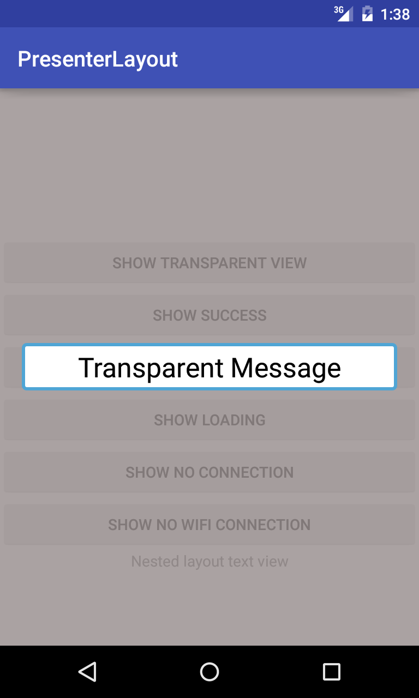
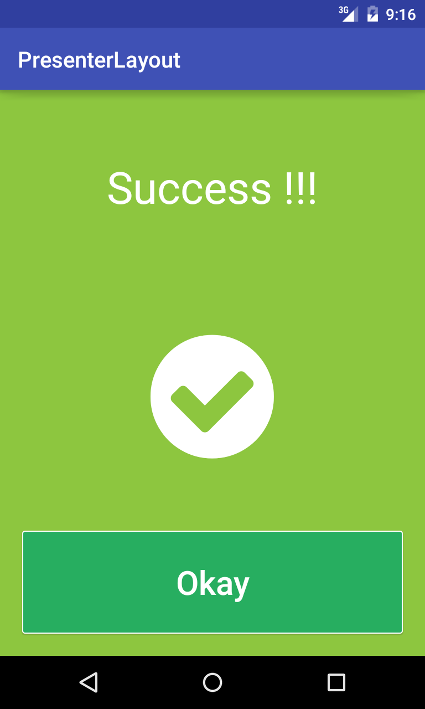
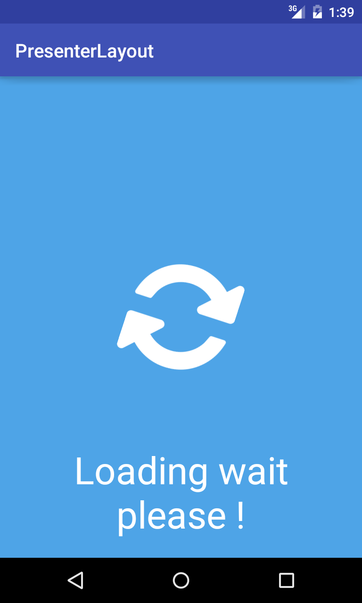
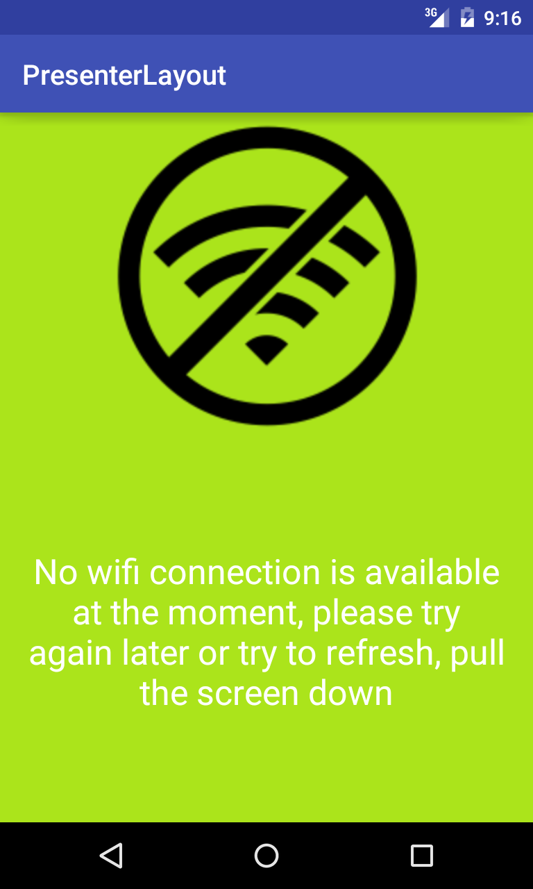
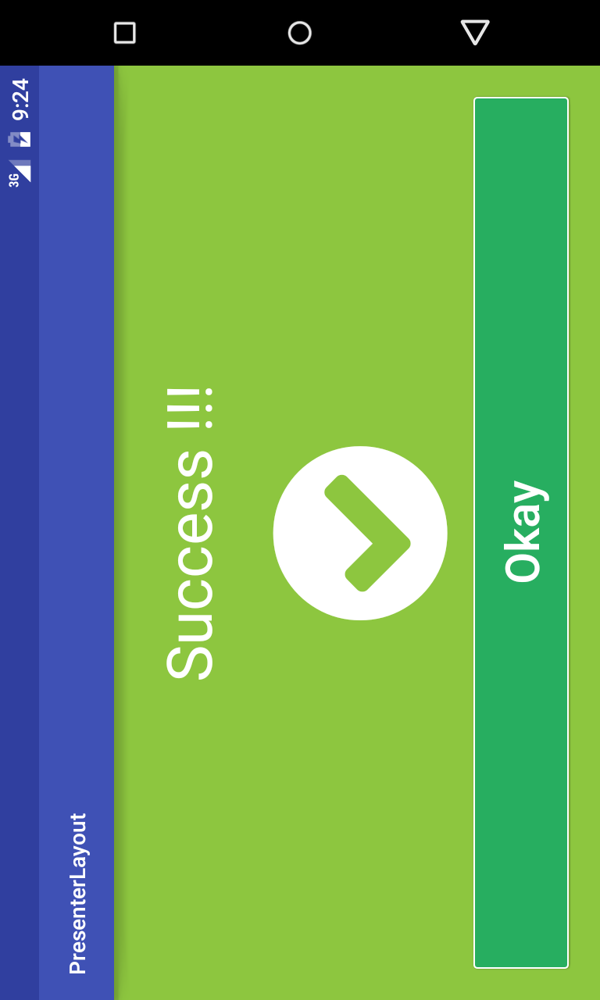

Presenter Layout
================


This library helps to display overlapping views (topmost) in order to show some kind of message to capture user attention.   
It can be an error, success message, loading bar or just simple text message.

Mostly every app has some actions that are performed in background like  data loading, I/O operations,
database querying and to notify user shows loading, but error may occurr or suddenly internet connection may lost, so user   
have to be notified about this.     
Moreover prevent app crashes because of user clicking everywhere while data is loading.   

**Presenter** name comes from [Android Clean Architecture](https://github.com/android10/Android-CleanArchitecture)
There is a presenter layer which responsible for updating and controlling UI and commonly has methods like `showLoading`,
`showErrorView`, `showSuccessView`.

So you are implementing such logic in every single `Activity` or `Fragment`. This is done through creating extra layouts and
views like `ProgressBar` in `XML` markup file or creating separate `XML` file and than using `<include>` tag.

To sum up, the idea of this library is to have one `Layout` that wraps all child views and layouts like any other `ViewGroup`,
but can show overlapping view on demand.

I would say this is more an example rather than library.

This library provides following features :

 * Several predefined overlappinge views `ErrorView`, `NoConnectionView`,`LoadingView` and `SuccessView`
 * Custom `ViewGroup` for controlling child and overlapping views
 * Posibility to create custom overlapping views
 * Support starting from `Android 2.1` (`API 7`)


Screenshots
-----------








Download and Installation 
-------------------------

Use Maven:
```xml
<dependency>
  <groupId>ua.com.crosp.solutions.library</groupId>
  <artifactId>presenter-layout</artifactId>
  <version>0.1.1</version>
</dependency>
```
or Gradle:
```groovy
compile 'ua.com.crosp.solutions.library:presenter-layout:0.1.1'
```
How does it work ?
------------------

`PresenterLayout` is custom compound `FrameLayout` that has two `FrameLayout`s in its `XML` layout. 
```xml
<?xml version="1.0" encoding="utf-8"?>
<merge xmlns:android="http://schemas.android.com/apk/res/android"
       android:layout_width="match_parent"
       android:layout_height="match_parent"
       android:orientation="vertical">
    <!--All child views are added to this layout in order to make overlapping views be
        always over these views -->
    <FrameLayout
        android:id="@+id/frame_layout_child_container"
        android:layout_width="match_parent"
        android:layout_height="match_parent"/>
    <!--Container where all views like progress, error, success ... are stored-->
    <FrameLayout
        android:id="@+id/frame_layout_overlapping_views_container"
        android:layout_width="match_parent"
        android:layout_height="match_parent"/>
</merge>
```

First `FrameLayout` is children container, all children from `XML` or added via `addView()` method go here.    
Second layout is used to keep all overlapping views, so they always is on the top of children


Usage
-----

First of all you are indentifying each view by ID, so you need to have unique ID when you are adding new overlapping view.

To add overlapping view there three methods

```java
public void addOverlappingView(View view, boolean hide);
public void addOverlappingView(View view);
public void addOverlappingView(View view, int index, ViewGroup.LayoutParams params);
public void addOverlappingView(View view, int width, int height);
```
As you may notice they have the same signature as default `addView` methods.

To remove overlapping view
```java
public void removeOverlappingView(View overlappingView);
public void removeOverlappingView(int viewId);
```

To show added view 
```java
public boolean showOverlappingView(int viewId, boolean hideOthers);
public boolean showOverlappingView(int viewId);
```

Again you have to pass unique ID of view, of course it should be set before using `setId()` method

Every app has it is own design and specific UI so it is very hard to create `View` that fits everywhere. 
But just to show the idea I created four custom default overlapping views.   

You can find all details in source code, it is simple.

There are four default overlapping view provided out of the box :
`ErrorView`, `SuccessView`, `NoConnectionView` and `LoadingView`.

`PresenterLayout` class provide delegation methods for these views.

**ErrorView**

```java
public void showErrorMessage(String errorMessage);
public void showErrorMessage();
public void hideErrorMessage();
public SwipeRefreshLayout getErrorRefreshLayout();
public void setErrorMessage(String errorMessage);
public void setErrorIcon(String errorIcon);
public void setErrorRefreshListener(SwipeRefreshLayout.OnRefreshListener onRefreshListener);
public void setErrorBackgroundColor(int backgroundColor);
```
**LoadingView**

```java
public void showLoading(String loadingMessage);
public void showLoading();
public void hideLoading();
public void setLoadingText(String loadingText);
public void setLoadingIcon(String loadingIcon);
public void setLoadingBackground(int color);
```
**SuccessView**

```java
public void showSuccess();
public void hideSuccess();
public void hideErrorMessage();
public void showSuccess(String successText);
public void setSuccessIcon(String successIcon);
public void setSuccessButtonText(String buttonText);
public void setSuccessBackgroundColor(int backgroundColor);
public void setSuccessText(String successText);
public void setSuccessButtonClickListener(OnClickListener successButtonClickListener);
```
**NoConnectionView**

```java
public void showNoConnection();
public void hideNoConnection();
public void showNoConnection(String message);
public void setNoConnectionText(String noConnectionText);
public void setNoConnectionIcon(String noConnectionIcon);
public void setNoConnectionBackgroundColor(int backgroundColor);
public void setNoConnectionRefreshListener(SwipeRefreshLayout.OnRefreshListener refreshListener);
public void SwipeRefreshLayout getNoConnectionRefreshLayout();
```

Moreover layout provides getters for these views, to my mind it is bad idea to expose view directly, but maybe someone wants to customize  
default view in runtime.

```java
public SuccessView getSuccessView();
public LoadingView getLoadingView();
public NoConnectionView getNoConnectionView();
public ErrorView getErrorView();
```

Also you can configure `PresenterLayout` in `XML` 

Here is an example 

```xml
<ua.com.crosp.solutions.library.presenterlayout.layout.PresenterLayout
    android:id="@+id/presenter_layout_main"
    xmlns:android="http://schemas.android.com/apk/res/android"
    xmlns:custom="http://schemas.android.com/apk/res-auto"
    android:layout_width="match_parent"
    android:layout_height="match_parent"
    custom:inflate_default_views="true"
    custom:show_initial_view="no_connection">
```

Example
-------

You can find example of app on [Google Play Store](https://play.google.com/store/apps/details?id=ua.com.crosp.solutions.presenterlayout)   
And of course in source code - module `app`

Contribution
------------

I would be grateful for any advice on improving library, especially default views.    
Thanks.


#Credits
- [Joan Zapata](https://github.com/JoanZapata)  The creator of [Android-Iconify](https://github.com/JoanZapata/android-iconify)
- [Vlonjat Gashi](https://github.com/vlonjatg/progress-activity) Thanks for the idea

License
-------

    Copyright 2016 Oleksandr Molochko

    Licensed under the Apache License, Version 2.0 (the "License");
    you may not use this file except in compliance with the License.
    You may obtain a copy of the License at

       http://www.apache.org/licenses/LICENSE-2.0

    Unless required by applicable law or agreed to in writing, software
    distributed under the License is distributed on an "AS IS" BASIS,
    WITHOUT WARRANTIES OR CONDITIONS OF ANY KIND, either express or implied.
    See the License for the specific language governing permissions and
    limitations under the License.


